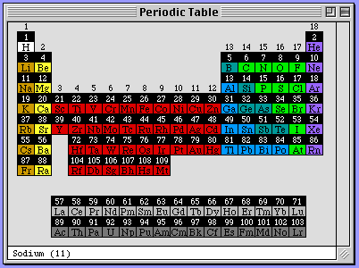
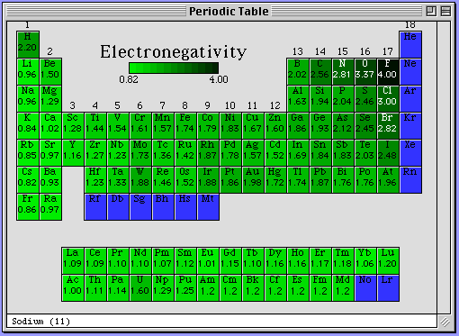
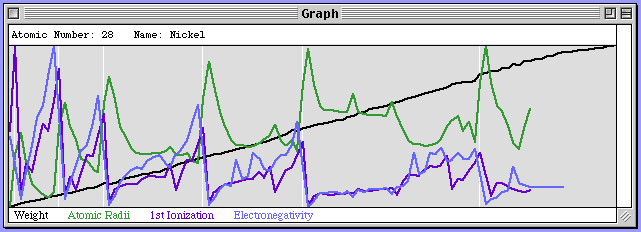

# Sodium

Sodium was a chemistry app I wrote when I was 13 for MacOS 7+. The main feature was a periodic table of the elements which could be dynamically colored based on the chemical properties of elements. It could also produce charts and calculate atomic weights.

## Technical details

It was written in C, originally built in [THINK C](https://en.wikipedia.org/wiki/THINK_C) (on a [Mac SE](https://en.wikipedia.org/wiki/Macintosh_SE)) but later built in [Metrowerks CodeWarrior](https://en.wikipedia.org/wiki/CodeWarrior), which could compile for both 68k and PPC architectures. These were the days before memory protection, virtualization, or pre-emptive multitasking. Memory was passed around via pointers to points ("handles") because these were pointers to actual memory addresses and the OS needed to be able to move allocated blocks of memory.

I'm especially proud of the support for live-scrolling: my windows would update the view while you were still dragging the scroll handle. Back then this required some custom event handlers and offscreen graphports.
